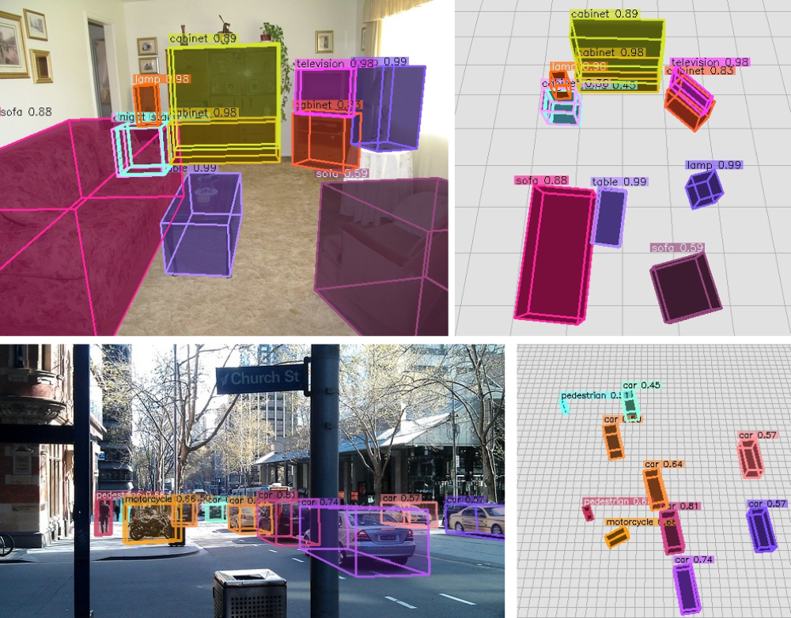

# Omni3D & Cube R-CNN

[](https://opensource.fb.com/support-ukraine)

**Omni3D: A Large Benchmark and Model for 3D Object Detection in the Wild**

[Garrick Brazil][gb], [Julian Straub][js], [Nikhila Ravi][nr], [Justin Johnson][jj], [Georgia Gkioxari][gg]

[[`Project Page`](https://garrickbrazil.com/omni3d)] [[`arXiv`](https://arxiv.org/abs/2207.10660)] [[`BibTeX`](#citing)]


<table style="border-collapse: collapse; border: none;">
<tr>
	<td width="60%">
		<p align="center">
			Zero-shot (+ tracking) on <a href="https://about.facebook.com/realitylabs/projectaria">Project Aria</a> data
			
		</p>
	</td>
	<td width="40%">
		<p align="center">
			Predictions on COCO
			
		</p>
	</td>
</tr>
</table>

<!--
## Cube R-CNN Overview
<p align="center">

</p>
-->

## Installation Requirements

- [Detectron2][d2]
- [PyTorch][pyt]
- [PyTorch3D][py3d]
- [COCO][coco]

``` bash
# setup new evironment
conda create -n cubercnn python=3.8
source activate cubercnn

# main dependencies
conda install -c fvcore -c iopath -c conda-forge -c pytorch3d-nightly -c pytorch fvcore iopath pytorch3d pytorch=1.8 torchvision cudatoolkit=10.1

# OpenCV, COCO, detectron2
pip install cython opencv-python
pip install 'git+https://github.com/cocodataset/cocoapi.git#subdirectory=PythonAPI'
python -m pip install detectron2 -f https://dl.fbaipublicfiles.com/detectron2/wheels/cu101/torch1.8/index.html

# other dependencies
conda install -c conda-forge scipy seaborn
```

We used cuda/10.1 and cudnn/v7.6.5.32 for our experiments, but expect that slight variations in versions are also compatible. 

## Demo

Run Cube R-CNN on a folder of input images using our DLA34 model trained on the full Omni3D dataset. See our [Model Zoo](MODEL_ZOO.md) for more model variations. 

``` bash
# Download example COCO images
sh demo/download_demo_COCO_images.sh

# Run an example demo
python demo/demo.py \
--config cubercnn://omni3d/cubercnn_DLA34_FPN.yaml \
--input-folder "datasets/coco_examples" \
--threshold 0.25 --display \
MODEL.WEIGHTS cubercnn://omni3d/cubercnn_DLA34_FPN.pth \
OUTPUT_DIR output/demo 
```

See [demo.py](demo/demo.py) for more details.


## Training on Omni3D
Coming soon!

## Inference on Omni3D
Coming soon!

## License
Cube R-CNN is released under [CC-BY-NC 4.0](LICENSE)

## Citing

Please use the following BibTeX entry if you use Omni3D and/or Cube R-CNN in your research or refer to our results.

```BibTeX
@article{brazil2022omni3d,
  author =       {Garrick Brazil and Julian Straub and Nikhila Ravi and Justin Johnson and Georgia Gkioxari},
  title =        {{Omni3D}: A Large Benchmark and Model for {3D} Object Detection in the Wild},
  journal =      {arXiv:2207.10660},
  year =         {2022}
}
```

[gg]: https://github.com/gkioxari
[jj]: https://github.com/jcjohnson
[gb]: https://github.com/garrickbrazil
[nr]: https://github.com/nikhilaravi
[js]: https://github.com/jstraub
[d2]: https://github.com/facebookresearch/detectron2
[py3d]: https://github.com/facebookresearch/pytorch3d
[pyt]: https://pytorch.org/
[coco]: https://cocodataset.org/

